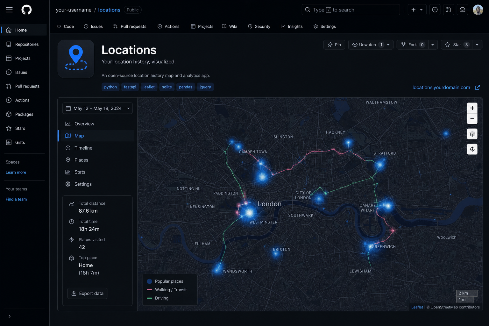

# Locations

Explore **your** Google Timeline as a private map journal — heatmaps, day views, trips, and insights.

Built on **Cloudflare Workers**, **Neon**, and **Better Auth**.



## Live site: demo + private

[locations.aden.website](https://locations.aden.website) hosts **both**:

1. **Public demo** — click “Try the demo” for sample journeys (no invite needed)
2. **Personal data** — invite-only accounts see the owner’s real timeline

Datasets are isolated by tenant in Neon (`demo` vs `personal`).

## Use your own data (recommended)

### What you need

- Node 20+
- Free [Neon](https://neon.tech) Postgres database
- (Optional) Cloudflare account to deploy
- Your Google Takeout **Location History** JSON, **or** the bundled sample

### Export from Google (optional)

1. Open [Google Takeout](https://takeout.google.com/)
2. Select **Location History** / Timeline only
3. Download and unzip until you find a JSON array of records with `visit` / `activity` (often named like `location-history.json`)
4. Keep that file **outside** git

### One-command setup

```bash
git clone https://github.com/Arbzy1/locations.git
cd locations
npm install
npm run setup
```

The wizard will:

1. Ask for your `DATABASE_URL`
2. Let you choose the **bundled sample** or a path to **your Takeout JSON**
3. Run migrate + import
4. Create your admin login (signup stays disabled)

Then locally:

```bash
npm run build:web
npm run dev:api    # open http://localhost:8787 and sign in
```

### Deploy your own copy

```bash
# In wrangler.toml: change worker name, BETTER_AUTH_URL, and custom domain
npx wrangler login
npx wrangler secret put DATABASE_URL
npx wrangler secret put BETTER_AUTH_SECRET
npm run deploy
```

You get your own `*.workers.dev` URL (or attach your domain). That is separate from `locations.aden.website`.

### Swap in real Takeout later

```bash
# .env
DATA_PATH=../my-location-history.json

npm run db:import   # replaces visits/activities/analytics in your Neon DB
```

Optional: `npm run db:warm-routes` to pre-cache road geometries (slow; otherwise routes fill on demand).

Invite another person to **your** instance:

```bash
npm run auth:create-user -- friend@email.com 'password' Friend user
```

## What it does

- **Hotspots** — visit density heatmap  
- **Day View** — map + timeline with OSRM-snapped journeys  
- **Day Trips** — multi-cluster / long-range days  
- **Insights** — distance, corridors, yearly/monthly stats  

## Stack

| Layer | Tech |
|-------|------|
| Edge | Cloudflare Workers + Static Assets |
| API | Hono |
| Auth | Better Auth (email/password, invite-only) |
| DB | Neon Postgres + Drizzle ORM |
| UI | React 19, Vite, Tailwind 4, Leaflet, Recharts |

```
Browser ──► Your Worker (assets + /api/*)
                │
                ├── Better Auth session
                └── Your Neon DB (imported from your JSON)
```

## Scripts

| Script | Purpose |
|--------|---------|
| `npm run setup` | Interactive first-time Neon + import + admin user |
| `npm run deploy` | Build web + `wrangler deploy` |
| `npm run db:migrate` | Apply schema |
| `npm run db:import` | Load JSON → Neon (full replace of location tables) |
| `npm run db:warm-routes` | Optional OSRM backfill |
| `npm run auth:create-user` | Invite a user |

## Privacy

- Real Takeout JSON is **gitignored** — only `data/sample-location-history.json` ships in the repo
- The public live site is invite-only and is **not** a multi-tenant host for other people's timelines
- Do not commit `.env`, `.dev.vars`, or Neon credentials

## License

MIT — see [LICENSE](LICENSE).
